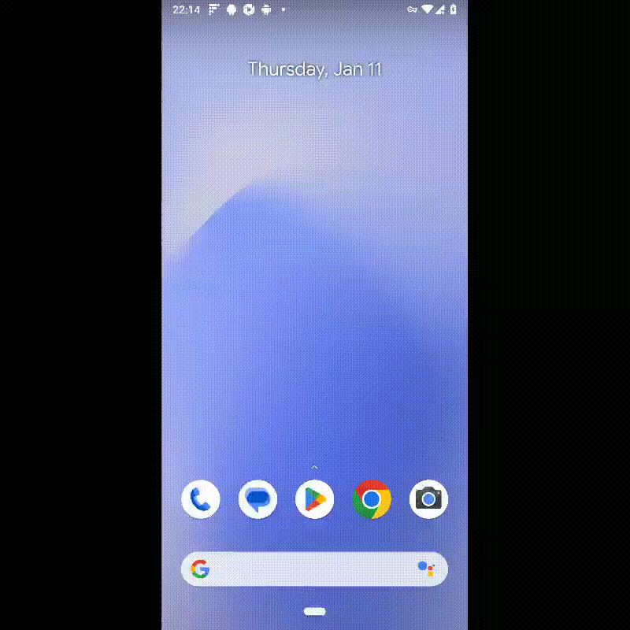

# Демо проект по автоматизации мобильного приложения [**Wikipedia

**](https://github.com/wikimedia/apps-android-wikipedia/)

<p align="center">

</p>


---

## **Содержание**:

---

* <a href="#tools">Технологии и инструменты</a>

* <a href="#cases">Примеры автоматизированных тест-кейсов</a>

* <a href="#console">Запуск из терминала</a>

* <a href="#allure_emulator">Отчет Allure при запуске локально на эмуляторе</a>

* <a href="#emulator_video">Пример видео выполнения тестов на Эмуляторе</a>

* <a href="#allure">Отчет Allure при запуске через Browserstack</a>

* <a href="#jenkins">Сборка в Jenkins</a>

* <a href="#allure-testops">Интеграция с Allure TestOps</a>

* <a href="#jira">Интеграция с Jira</a>

* <a href="#telegram">Уведомление в Telegram при помощи бота</a>

* <a href="#browserstack_video">Пример видео выполнения тестов на Browserstack</a>

---

<a id="tools"></a>

## <a name="Технологии и инструменты">**Технологии и инструменты:**</a>

<p align="center">  
<a href="https://www.jetbrains.com/idea/"></a>  
<a href="https://www.java.com/"></a>  
<a href="https://github.com/"></a>  
<a href="https://junit.org/junit5/"></a>  
<a href="https://gradle.org/"></a>  
<a href="https://selenide.org/"></a>  
<a href="https://developer.android.com/studio/"></a>  
<a href="https://appium.io/docs/en/2.4/"></a>  
<a href="https://app-automate.browserstack.com/"></a>  
<a href="https://github.com/allure-framework/allure2"></a> 
<a href="https://qameta.io/"></a>   
<a href="https://www.jenkins.io/"></a>  
<a href="https://www.atlassian.com/ru/software/jira/"></a>
<a href="https://core.telegram.org/bots/api/"></a> 
</p>

* Проект написан в среде разработки программного обеспечения <code>Intelij_IDEA</code>.
* В проекте автотесты написаны на языке <code>Java</code> с использованием фреймворка для тестирования <code>
  Selenide</code>.
* Использованы фреймворк <code>JUnit 5</code>.
* В качестве сборщика был использован - <code>Gradle</code>.
* Для удаленного запуска реализована джоба в <code>Jenkins</code>, которая выполняет тесты на устройстве Android в <code>Browserstack</code> с формированием отчета в <code>Allure</code> и
  отправкой результатов в <code>Telegram</code> c помощью бота.
* Осуществлена интеграция с <code>Allure TestOps</code> с <code>Jenkins</code>, при которой возможен запуск тестов
  из <code>Allure TestOps</code>.
* Осуществлена интеграция <code>Jira</code> с <code>Allure TestOps</code>, где рерультат прогона авто-тестов
  подтягивается в задачу в <code>Jira</code>.
* Так же реадизована возможность запускать тесты локально в <code>Android-studio</code> через эмулятор.


---
<a id="cases"></a>

## <a name="Примеры автоматизированных тест-кейсов">**Примеры автоматизированных тест-кейсов:**</a>

- *Проверка поиска*
- *Проверка искомого запроса в статье*
- *Проверка текстов на экранах онбординга*

<a id="console"></a>

## <a name="Запуск тестов из терминала">**Запуск тестов из терминала:**</a>

***Удаленный запуск тестов:***

```bash
gradle clean test -DdeviceHost=browserstack
```

***Локальный запуск тестов:***

```bash
 gradle clean test -DdeviceHost=emulator
```

---
<a id="jenkins"></a>

## </a><a name="Сборка"></a>Сборка в [Jenkins](https://jenkins.autotests.cloud/job/qa_guru_allure_example_23_maxaten/)</a>

<p align="center">  
<a href="https://jenkins.autotests.cloud/job/Project%20qa_guru_java_lesson_17_mag_maxaten/"></a>  
</p>

<a id="allure"></a>

## </a> <a name="Allure"></a>[Отчет](https://jenkins.autotests.cloud/job/qa_guru_allure_example_24_maxaten/allure/) Allure при запуске через Browserstack</a>

### *Основная страница отчёта*

<p align="center">  
  
</p>

### *Тест-кейсы*

<p align="center">  
  
</p>

### *Графики*

  <p align="center">  


  
</p>


___
<a id="allure-testops"></a>

## </a>Интеграция с [Allure TestOps](https://allure.autotests.cloud/project/3954/dashboards)</a>

### *Allure TestOps Dashboard*

<p align="center">  
  
</p>  

### *Авто тест-кейсы*

<p align="center">  
  
</p>

___
<a id="jira"></a>

## </a> Интеграция с [Jira](https://jira.autotests.cloud/browse/HOMEWORK-1043)</a>

<p align="center">  
  
</p>

___
<a id="telegram"></a>

## </a> Уведомление в Telegram при помощи бота

<p align="center">  
  
</p>

---
<a id="browserstack_video"></a>

## </a> Пример видео выполнения тестов на Browserstack

<p align="center">
   
</p>

---
<a id="allure_emulator"></a>

## </a> <a name="Allure"></a>Отчет Allure при запуске локально на эмуляторе</a>

### *Основная страница отчёта*

<p align="center">  
  
</p>

### *Тест-кейсы*

<p align="center">  
  
</p>

---
<a id="emulator_video"></a>

## </a> Пример видео выполнения тестов на Эмуляторе

<p align="center">
   
</p>


